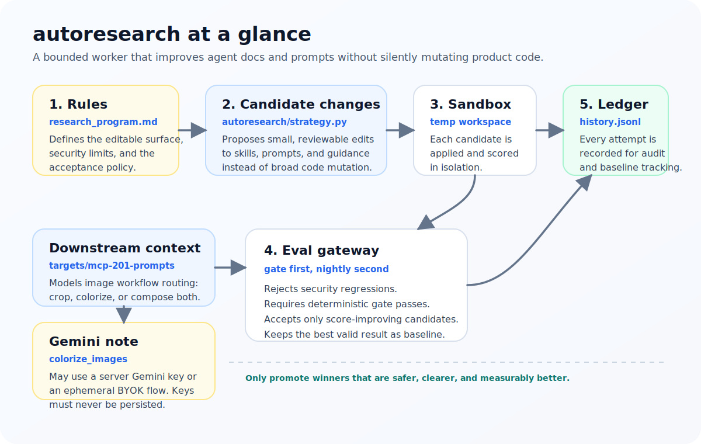

# autoresearch

`autoresearch` is a bounded research worker for agent-facing content. Instead of mutating application code directly, it proposes small changes to prompts, skill docs, and tool-use guidance, runs deterministic evaluations, rejects unsafe regressions, and records every attempt in an append-only ledger.

The goal is to make prompt and skill iteration measurable, reviewable, and secure.



For the longer onboarding brief, read `docs/agent-handoff.md`.

## What this project does

On each run, the worker:

1. reads the optimization constraints from `research_program.md`
2. proposes a bounded candidate edit to the approved text surface
3. evaluates the untouched baseline and each candidate in isolation
4. rejects anything that weakens security or fails deterministic gates
5. accepts only the best score-improving candidate
6. appends all results to `experiments/history.jsonl`

This is intentionally not a general autonomous code editor. The default mutation surface is agent-readable text.

## Why the repo is structured this way

The repository is self-contained so a fresh clone can run locally without sibling repos:

- `targets/skills-201/` is the main bundled mutation surface
- `targets/mcp-201-prompts/` is a downstream prompt-routing surface used to make the portfolio more realistic
- `datasets/` contains the bundled deterministic gate and nightly evaluation data

That layout lets you test the research loop locally before worrying about deployment or wider portfolio integration.

## How the pieces fit together

- `research_program.md`: human-owned guardrails, editable surface, and acceptance policy
- `autoresearch/loop.py`: orchestrates baseline evaluation, candidate evaluation, ranking, and acceptance
- `autoresearch/strategy.py`: generates the bounded prompt and skill changes
- `autoresearch/workspace.py`: creates isolated temp workspaces so source files are not mutated during evaluation
- `autoresearch/evaluation.py`: runs the `Skills201EvalGateway` with gate-first logic
- `autoresearch/storage.py`: stores experiment history and derives the current accepted baseline
- `autoresearch/cli.py`: command-line entrypoint
- `tests/`: unit tests covering the loop and acceptance behavior
- `scripts/`: setup, test, local run, and container build helpers

## `skills-201` vs `mcp-201`

The repo has two important bundled surfaces:

- `skills-201` is the current primary optimization target. It contains the skill docs and README material that the loop edits and scores.
- `mcp-201-prompts` is a smaller prompt-routing surface for image workflows. It models cases like crop only, colorize only, or crop-then-colorize, and includes guidance that `colorize_images` may use either a server Gemini key or an ephemeral BYOK flow.

Today, `mcp-201` is useful project context and a likely downstream validation surface. It is not yet the main mutation target.

## Security and operating guardrails

These constraints are central to the project:

- no direct production writes from the loop
- no secret persistence
- no bypass of RLS or other security controls
- no widening of the editable surface without explicit approval
- deterministic gates must pass before broader scoring matters
- no SQL script generation

If you are new to the repo, these guardrails matter as much as the scoring logic.

## Local setup

Prerequisites:

- Python 3.11+
- `pip`

Bootstrap the local environment:

```bash
./scripts/setup_local.sh
```

What this should give you:

- a local virtual environment
- the package installed in editable mode
- a repo that is ready to run tests and one research iteration

## Run the project locally

Run the test suite first:

```bash
./scripts/run_tests.sh
```

Run one local research iteration:

```bash
./scripts/run_local.sh
```

Expected outcome:

- the loop evaluates the baseline plus bounded candidates
- deterministic gates run before broader scoring
- the best acceptable candidate is reported
- results are appended to `experiments/history.jsonl`

Render a static HTML report from the ledger:

```bash
./scripts/render_report.sh
```

That writes `experiments/report.html`, which gives you summary cards, a score trend, and a table of recorded candidates.

You can also view the report through a tiny local web server:

```bash
./scripts/run_web.sh
```

Then open `http://localhost:8000`.

The server exposes:

- `/` or `/report.html`: rendered HTML report
- `/api/history`: raw ledger data plus summary JSON
- `/health`: lightweight health check

To enable a `Run Once Now` button in the web UI:

- set `AUTORESEARCH_WEB_ENABLE_RUN=1`
- optional: set `AUTORESEARCH_WEB_RUN_STRATEGY=llm` to trigger the LLM-backed strategy instead of the default library strategy
- if you use LLM mode, also provide the required LLM env vars such as `AUTORESEARCH_GEMINI_API_KEY`

You can also run the CLI directly after activation:

```bash
. .venv/bin/activate
python -m autoresearch.cli --ledger experiments/history.jsonl
```

To try the optional LLM-backed proposal path, keep deterministic eval as the acceptance gate and pass `--strategy llm`:

```bash
. .venv/bin/activate
export AUTORESEARCH_GEMINI_API_KEY=your_key_here
python -m autoresearch.cli --strategy llm --llm-model gemini-2.0-flash
```

Supported LLM generation settings:

- `AUTORESEARCH_LLM_PROVIDER` defaults to `gemini`
- `AUTORESEARCH_LLM_MODEL` defaults to `gemini-2.0-flash`
- `AUTORESEARCH_LLM_API_KEY_ENV` defaults to `AUTORESEARCH_GEMINI_API_KEY`
- `AUTORESEARCH_LLM_MAX_CANDIDATES` defaults to `4`
- `AUTORESEARCH_LLM_MAX_PATCH_CHARS` defaults to `1600`

## What success looks like

After reading this README and following the setup steps, you should understand:

- this repo improves agent docs and prompts, not product code
- the worker is intentionally bounded and security-first
- `skills-201` is the main editable target today
- `mcp-201` provides realistic downstream workflow context around image routing and Gemini-backed colorization
- a successful local run writes an append-only experiment record instead of silently mutating the target files

## Deployment model

This project is designed primarily as a scheduled worker, but it can also expose a tiny report viewer over HTTP for local use or simple Railway deployments.

Build the container image:

```bash
./scripts/deploy_docker.sh
```

Example container run:

```bash
docker run --rm -v "$(pwd)/experiments:/app/experiments" autoresearch:local
```

### Railway

Railway can run this repo as a worker service using the included `Dockerfile`.
The repo now also includes `railway.toml` so the build, start command, and health check can stay in code.

Recommended Railway setup:

- attach a volume at `/data`
- by default, Railway deployments now assume web mode and `/data` storage
- set `AUTORESEARCH_GEMINI_API_KEY`
- set `AUTORESEARCH_WEB_RUN_TOKEN`

The container entrypoint supports two modes:

- `AUTORESEARCH_SERVICE_MODE=web`: start the tiny web server and serve the report on `PORT` or `AUTORESEARCH_WEB_PORT`
- `AUTORESEARCH_ON_DEMAND=1`: run one iteration on startup, then stay idle so Railway keeps the service up until you manually redeploy it
- `AUTORESEARCH_RUN_INTERVAL_SECONDS=0` or unset: run one iteration and exit
- `AUTORESEARCH_RUN_INTERVAL_SECONDS>0`: keep the worker alive and rerun on that interval

Default behavior on Railway when no non-secret overrides are set:

- service mode defaults to `web`
- ledger path defaults to `/data/history.jsonl`
- report path defaults to `/data/report.html`
- web trigger controls default to enabled
- web trigger strategy defaults to `llm`

Useful web-mode environment variables:

- `AUTORESEARCH_LEDGER_PATH`: optional override for the ledger path, default `/data/history.jsonl` on Railway
- `AUTORESEARCH_REPORT_PATH`: optional override for the HTML report path, default `/data/report.html` on Railway
- `AUTORESEARCH_WEB_HOST`: bind host, defaults to `0.0.0.0`
- `AUTORESEARCH_WEB_PORT`: bind port, defaults to `8000` unless Railway provides `PORT`
- `AUTORESEARCH_WEB_ENABLE_RUN`: optional override, defaults to enabled on Railway
- `AUTORESEARCH_WEB_RUN_TOKEN`: bearer token required for `POST /api/run`
- `AUTORESEARCH_WEB_RUN_STRATEGY`: `library` or `llm`, defaults to `llm` on Railway
- `AUTORESEARCH_WEB_RUN_TIMEOUT_SECONDS`: timeout for UI-triggered runs, defaults to `600`

Example trigger call:

```bash
curl -X POST \
  -H "Authorization: Bearer $AUTORESEARCH_WEB_RUN_TOKEN" \
  https://<your-service-domain>/api/run
```

In worker mode, the service does not need to expose an HTTP port. In web mode, Railway should route traffic to the assigned `PORT`.

## If you need deeper context

Use `docs/agent-handoff.md` for:

- a faster architecture handoff
- runtime flow details
- what the eval measures today
- gaps that are still not implemented
- the safest next extensions
